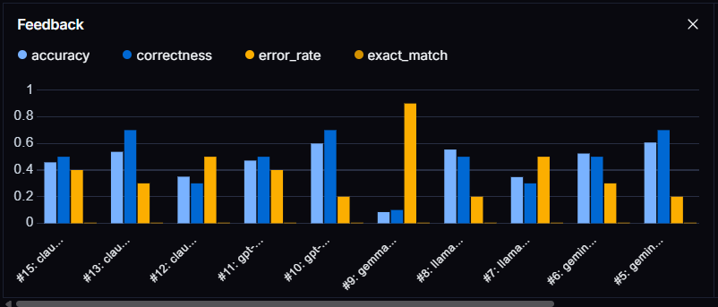
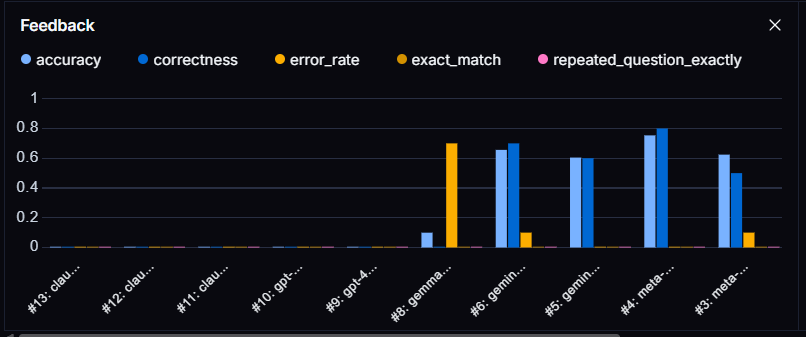
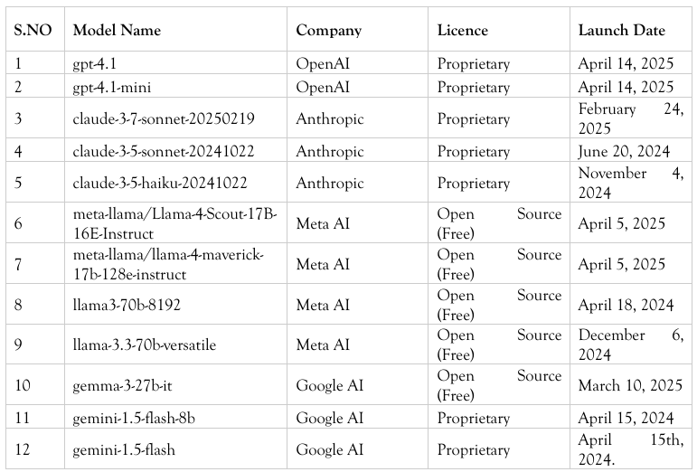
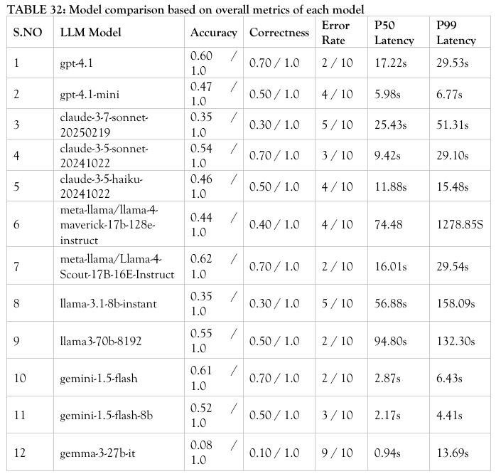
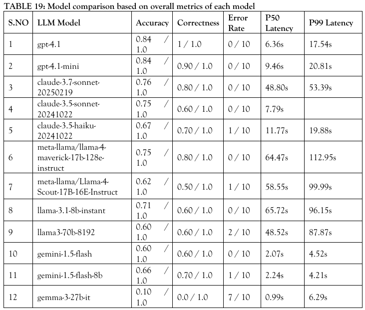

<div align="center">
  <h1>Evaluating the Performance of LLMs on SQL and NoSQL Databases Using LangSmith</h1>
  
</div>

<div align="center">
  <a href="./LICENSE">
    
  </a>
  <a href="https://theaspd.com/index.php/ijes/article/view/3041">
    
  </a>
  <a href="./research_doc/publication_evaluating_llms.pdf">
    
  </a>
  <a href="https://github.com/YUGESHKARAN/MySQL-RAG-EVALUATION">
    
  </a>
  <a href="https://github.com/YUGESHKARAN/MongoDB-RAG-EVALUATION">
    
  </a>
</div>


---

This research evaluates the performance of **12 LLMs from leading AI organizations - OpenAI, Meta AI, Google AI, and Anthropic** across **MySQL and MongoDB RAG systems**, using **LangSmith as the primary evaluation and observability platform**. The objective is not merely to build database RAG systems, but to systematically identify which LLMs perform best for **SQL and NoSQL database question-answering workloads**. Using LangSmith, the experiments track and compare key evaluation and performance metrics including **accuracy, correctness, error rate, P50 latency, and P99 latency**, providing a consistent framework for benchmarking LLM behavior across different database environments.

<div align="center">

<table>
  <tr>
    <td align="center">
      
      <br />
      <strong>Eval Graph of MongoDB RAG</strong>
    </td>
    <td align="center">
      
      <br />
      <strong>Eval Graph of MySQL RAG</strong>
    </td>
  </tr>
</table>

</div>

---
## LLM Models Used

The following LLMs were evaluated across the MySQL RAG and MongoDB RAG experiments:

<p align="center">
  
</p>

---
## Evaluation Metrics

The following evaluation metrics are used to assess the performance, accuracy, reliability, and responsiveness of the database RAG system.

### 1. Accuracy - Custom Evaluator

The **Accuracy** metric evaluates the semantic similarity between the generated response and the reference response. It uses **Sentence-BERT (SBERT)** along with **cosine similarity** to determine how closely the two responses match in meaning.

SBERT converts both responses into vector embeddings. Cosine similarity is then calculated between these embeddings. This allows the evaluation to recognize responses that use different words or sentence structures but convey the same meaning.

```python
def accuracy(outputs: dict, reference_outputs: dict) -> float:
    """Computes similarity between obtained and reference outputs."""
    output_text = outputs.get("response", "")
    reference_text = reference_outputs.get("output", "")

    if not output_text or not reference_text:
        print("Warning: Missing output text, returning 0 similarity.")
        return 0.0  # Avoid crashing if output is missing

    # Compute similarity
    model = joblib.load("sbert_model.pkl")
    output_embedding = model.encode(output_text, convert_to_tensor=True)
    reference_embedding = model.encode(reference_text, convert_to_tensor=True)

    similarity = util.pytorch_cos_sim(
        output_embedding,
        reference_embedding
    ).item()

    return similarity
```

The resulting score is a continuous similarity value, where a higher score indicates greater semantic similarity between the generated and reference responses.

### 2. Correctness - Custom Evaluator

The **Correctness** metric determines whether the generated response is sufficiently similar to the expected reference response. It converts the semantic similarity score into a **binary value**:

* **1** - Correct
* **0** - Incorrect

For this system, a **threshold of 0.69** is used. The SBERT cosine similarity score is first calculated using the Accuracy metric. If the score is greater than 0.69, the response is considered correct; otherwise, it is considered incorrect.

```python
def Correctness(outputs: dict, reference_outputs: dict) -> int:
    """Checks if similarity is above 0.69 threshold."""

    similarity_score = accuracy(outputs, reference_outputs)

    return 1 if similarity_score > 0.69 else 0
```

This metric provides a straightforward measure of how frequently the RAG system produces responses that meet the defined semantic similarity threshold.

### 3. Error Rate - Custom Evaluator

The **Error Rate** metric measures whether the system fails to provide a response. It is represented as a binary value:

* **1** - Error occurred because the response is missing or empty
* **0** - No error because a valid response was generated

This metric focuses specifically on response-generation failures rather than the semantic correctness of the generated content.

```python
def error_rate(outputs: dict, reference_outputs: dict) -> float:
    """Calculates error rate based on empty or missing responses."""

    output_text = outputs.get("response", "")

    if not output_text:  # If no response or empty output
        return 1.0  # 100% error for this instance

    return 0.0  # No error if a valid response is present
```

A lower overall error rate indicates that the system consistently produces valid responses without response-generation failures.

### 4. Latency - P50 and P99

**Latency** measures the time taken by the database RAG system to generate a response after receiving a user query. It is used to evaluate the responsiveness and performance of the system.

Two latency percentiles are considered:

* **P50 (50th percentile):** Represents the median response latency. It indicates the typical response time experienced by users.
* **P99 (99th percentile):** Represents the response latency for the slowest 1% of requests. It helps identify occasional performance spikes and worst-case response delays.

Using both P50 and P99 provides a more complete view of system performance. P50 reflects the **typical user experience**, while P99 helps evaluate **tail latency and system reliability under slower requests**.

Together, these metrics help assess how efficiently the LLM-powered RAG system processes and responds to user queries.

## LLM Benchmark Results

<table>
  <tr>
    <td align="center" width="50%">
      <strong>Models Benchmark for MongoDB RAG System</strong>
    </td>
    <td align="center" width="50%">
      <strong>Models Benchmark for MySQL RAG System</strong>
    </td>
  </tr>
  <tr>
    <td valign="top">

The MongoDB RAG evaluation showed significant variation across the twelve LLMs. **meta-llama/llama-4-scout** achieved the highest overall performance with **62% accuracy, 70% correctness, and 20% error rate**, with a total latency of **29.54s**. **gemini-1.5-flash** achieved comparable accuracy and correctness (**61% and 70%**) while delivering substantially better latency at just **6.43s**, making it approximately **4× faster** than llama-4-scout.

<br>



</td>
<td valign="top">

The MySQL RAG evaluation showed stronger overall performance across the twelve LLMs. **gpt-4.1** and **gpt-4.1-mini** demonstrated the best results. **gpt-4.1** achieved **85% accuracy, 100% correctness, and 0% error rate**, with a total latency of **17.54s**. **gpt-4.1-mini** also achieved **85% accuracy and 0% error rate**, with **90% correctness** and **20.81s** latency. Although the Gemini models provided lower latency, they performed comparatively worse in accuracy, correctness, and error rate.

<br>



</td>
  </tr>
</table>

### Key Observation

Overall, the LLMs demonstrated **better performance on the MySQL RAG system than on the MongoDB RAG system**. The results suggest that LLMs face greater challenges when generating queries against the more unstructured nature of NoSQL data. Integrating SQL and NoSQL databases with a real-time vector database could potentially improve query generation and retrieval performance.

